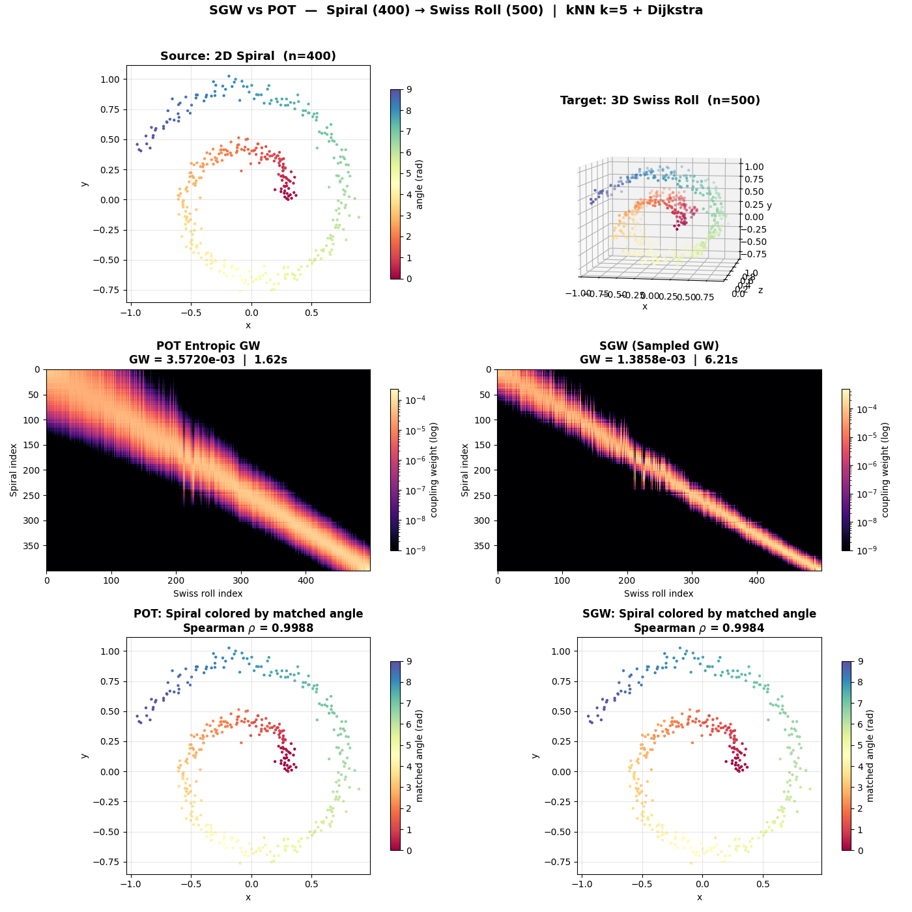
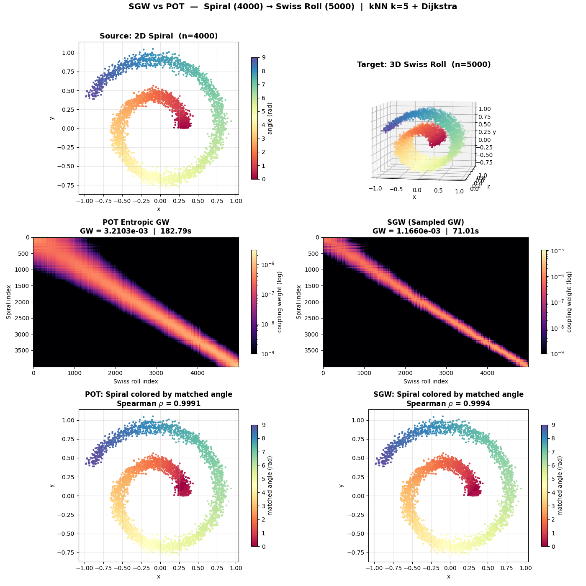

<p align="center">
  
</p>

# SGW — Sampled Gromov-Wasserstein

[](https://chansigit.github.io/sgw/)
[](https://github.com/chansigit/sgw)

A scalable solver for [Gromov-Wasserstein](https://arxiv.org/abs/1805.09114) optimal transport,
implemented in **pure PyTorch** (no POT dependency at runtime).

Instead of computing the full *N×K* cost matrix each iteration,
SGW **samples** *M* anchor pairs and approximates the GW cost using only the
distances from those anchors, reducing the per-iteration cost from *O(NK(N+K))* to *O(NKM)*.

The API follows [POT](https://pythonot.github.io/) conventions
(`epsilon` for regularization, `tol` for convergence, `p`/`q` for marginals, `log` for diagnostics).

## Features

- **Pure PyTorch** — log-domain Sinkhorn on GPU, zero CPU↔GPU data transfer
- **Scalable** — O(NKM) per iteration via anchor-pair sampling
- **Three distance strategies** — `precomputed`, `dijkstra` (default), `landmark` for different scales
- **Fused GW** — blend structural GW cost with a feature-space linear cost via `fgw_alpha`
- **Multi-scale warm start** — coarse-to-fine solving with FPS downsampling
- **Low-rank Sinkhorn** — `sampled_lowrank_gw` for memory-constrained large-scale problems (N, K > 50k)
- **Semi-relaxed GW** — relax the target marginal for unbalanced datasets
- **Differentiable** — optional `differentiable=True` keeps the computation graph
- **Joint embedding** — shared manifold embedding via graph Laplacians + transport plan
- **Tensor I/O** — accepts and returns `torch.Tensor` (numpy also accepted as input)

## Installation

```bash
pip install -e .
```

Dependencies: `numpy`, `scipy`, `scikit-learn`, `torch`, `joblib`.
No POT required at runtime (only needed for the comparison example).

## Quick start

```python
import torch
from sgw import sampled_gw, sampled_lowrank_gw

# Two point clouds (dimensions may differ)
X = torch.randn(500, 3)
Y = torch.randn(600, 5)

# Compute transport plan (returns torch.Tensor)
T = sampled_gw(X, Y, epsilon=0.005, M=80, max_iter=200)
print(T.shape)  # (500, 600)

# Precomputed distance matrices (no point clouds needed)
D_X = torch.cdist(X, X)
D_Y = torch.cdist(Y, Y)
T = sampled_gw(dist_source=D_X, dist_target=D_Y, distance_mode="precomputed")

# Fused GW: blend structural + feature cost
C_feat = torch.cdist(X[:, :3], Y[:, :3])  # feature cost (same dim required)
T = sampled_gw(X, Y, fgw_alpha=0.5, C_linear=C_feat)

# Multi-scale warm start (coarse solve → fine solve)
T = sampled_gw(X, Y, multiscale=True)

# Low-rank Sinkhorn for very large problems (memory optimization)
T = sampled_lowrank_gw(X, Y, rank=30, distance_mode="landmark")
```

## API

### `sampled_gw`

```python
sampled_gw(
    X_source=None,          # (ns, D) source features (Tensor or ndarray)
    X_target=None,          # (nt, D2) target features
    p=None,                 # (ns,) source marginals (uniform if None)
    q=None,                 # (nt,) target marginals (uniform if None)
    *,
    # Distance strategy
    distance_mode="dijkstra",  # "precomputed" | "dijkstra" | "landmark"
    dist_source=None,       # (ns, ns) precomputed distance matrix
    dist_target=None,       # (nt, nt) precomputed distance matrix
    n_landmarks=50,         # landmark count (only for distance_mode="landmark")

    # Fused GW
    fgw_alpha=0.0,          # 0 = pure GW, 1 = pure Wasserstein
    C_linear=None,          # (ns, nt) feature cost matrix (required if fgw_alpha > 0)

    # Solver parameters
    s_shared=None,          # shared samples estimate (default: min(ns,nt))
    M=50,                   # anchor pairs per iteration
    alpha=0.9,              # momentum
    max_iter=500,           # maximum iterations
    tol=1e-5,               # convergence threshold
    epsilon=0.001,          # entropic regularization
    k=30,                   # kNN neighbors
    device=None,            # torch device (auto-detected)
    verbose=False,          # print progress
    log=False,              # return (T, log_dict) with convergence info
    differentiable=False,   # keep computation graph for backprop
    semi_relaxed=False,     # relax target marginal constraint
    rho=1.0,                # KL penalty for relaxed marginal
    multiscale=False,       # coarse-to-fine warm start
    n_coarse=None,          # coarse problem size (auto if None)
)
```

**Returns** a `torch.Tensor` of shape `(ns, nt)`.
With `log=True`, returns `(T, {"err_list": [...], "n_iter": int, "gw_cost": float})`.

### `sampled_lowrank_gw`

Low-rank variant for memory-constrained large-scale problems. Uses the
[Scetbon, Cuturi & Peyre (2021)](https://arxiv.org/abs/2103.04737) algorithm
to factorize the transport plan, reducing Sinkhorn memory from O(NK) to O((N+K)*r).

```python
sampled_lowrank_gw(
    X_source=None, X_target=None, p=None, q=None,
    *,
    rank=20,                   # nonneg. rank of transport plan factorization
    lr_max_iter=5,             # outer mirror descent iterations per Sinkhorn call
    lr_dykstra_max_iter=50,    # inner Dykstra iterations per Sinkhorn call
    # ... all other parameters same as sampled_gw (except differentiable)
)
```

> **Note:** This is a **memory optimization**, not a speed optimization. At moderate
> scales (N, K < 50k), `sampled_gw` with standard Sinkhorn is significantly faster.
> Use `sampled_lowrank_gw` only when the full N×K transport plan does not fit in memory.

### Distance modes

| Mode | When to use | How it works |
|------|------------|--------------|
| `"precomputed"` | N, K < ~5k | Precomputes all-pairs shortest paths; fastest per-iteration |
| `"dijkstra"` | 5k–50k (default) | Runs Dijkstra from M sampled anchors each iteration |
| `"landmark"` | N, K > 50k | Precomputes distances to d landmark nodes via farthest-point sampling; GPU-accelerated |

See [examples/benchmark_distance_modes.md](examples/benchmark_distance_modes.md) for a detailed comparison.

### Fused GW

Blend graph-distance GW (structural) with a feature-space Wasserstein (linear) cost:

```python
# Lambda = (1 - fgw_alpha) * Lambda_gw + fgw_alpha * C_linear
T = sampled_gw(X, Y, fgw_alpha=0.5, C_linear=C_feat)

# Pure Wasserstein (no structural distances needed)
T = sampled_gw(fgw_alpha=1.0, C_linear=C_feat)
```

### Multi-scale warm start

Two-stage coarse-to-fine solving: downsample via FPS, solve the coarse GW problem,
upsample the solution to warm-start the full problem.

```python
T = sampled_gw(X, Y, multiscale=True)
T = sampled_gw(X, Y, multiscale=True, n_coarse=200)  # custom coarse size
```

> **Note:** GW has multiple equivalent local optima (e.g., forward and reverse
> matching). The coarse solve may converge to a different optimum, which is then
> inherited by the fine solve. This works best on data without strong symmetries.

### Semi-relaxed mode

When source and target have different compositions (e.g., a cell type
present in source but absent in target), balanced GW forces mass onto
wrong matches. Semi-relaxed GW fixes the source marginal but lets the
target marginal adapt:

```python
# Balanced (default): T @ 1 = p,  T.T @ 1 = q  (both enforced)
T = sampled_gw(X, Y, epsilon=0.005)

# Semi-relaxed: T @ 1 = p (enforced),  T.T @ 1 ≈ q (soft KL penalty)
T = sampled_gw(X, Y, epsilon=0.005, semi_relaxed=True, rho=1.0)
```

### `build_knn_graph`

```python
build_knn_graph(X, k=30)  # → csr_matrix, guaranteed connected
```

Builds a *k*-NN distance graph with automatic stitching of disconnected components.

### `joint_embedding`

```python
joint_embedding(
    anchor_name,        # name of reference dataset
    data_by_name,       # {"src": X_src, "tgt": X_tgt}
    graphs_by_name,     # {"src": g_src, "tgt": g_tgt}
    transport_plans,    # {("src", "tgt"): T}
    out_dim=30,         # embedding dimensions
)
```

Computes a joint manifold embedding via graph Laplacians and the transport plan.

## Comparison with POT

Both methods are run with **identical preprocessing** (same kNN graph, same Dijkstra shortest paths).
Timings below are **pure OT solver time** (GPU cost matrix + Sinkhorn), excluding graph construction and Dijkstra preprocessing:

| Scale | Method | Solver time (100 iter) | GW distance | Spearman |
|-------|--------|----------------------|-------------|----------|
| 400 vs 500 | POT `entropic_gromov_wasserstein` | 1.6s | 3.57e-03 | 0.999 |
| 400 vs 500 | SGW `sampled_gw` | 0.9s | **1.39e-03** | 0.998 |
| 4000 vs 5000 | POT `entropic_gromov_wasserstein` | 183s | 3.21e-03 | 0.999 |
| 4000 vs 5000 | SGW `sampled_gw` | **2.4s** | **1.17e-03** | **0.999** |

The pure OT computation (cost matrix assembly + Sinkhorn projection) runs entirely on GPU.
At 4000×5000, **SGW's solver is ~75× faster** than POT with equal or better accuracy.

> **Note:** End-to-end wall time includes CPU-side Dijkstra and sampling overhead
> (~70s total for 4000×5000 at 300 iterations). The GPU solver itself is not the bottleneck.

### 400 vs 500 (small scale)



### 4000 vs 5000 (large scale — SGW 2.6× faster)



## How it works

Each iteration of SGW:

1. **Sample** *M* anchor pairs `(i, j)` from the current transport plan *T*
2. **Compute distances** from all points to the sampled anchors (via the chosen distance strategy)
3. **GW cost matrix** Λ = mean(D²\_left) − 2·(D\_left @ D\_tgt^T)/M + mean(D²\_tgt)
4. **FGW blending** (optional): Λ = (1−α\_fgw)·Λ\_gw + α\_fgw·C\_linear
5. **Sinkhorn** — standard (augmented, log-domain) or low-rank (Dykstra projection)
6. **Momentum update** T ← (1−α)·T\_prev + α·T\_new

Key implementation details:
- **Pure PyTorch** log-domain Sinkhorn — runs entirely on GPU, no POT dependency
- Marginals and Sinkhorn in **float64** for numerical stability
- Cost matrix in **float32** on GPU for speed
- `torch.no_grad()` by default; set `differentiable=True` to keep the computation graph
- GC only every 50 iterations (avoids the 78% overhead from per-iteration GC)

## Examples

```bash
# Distance mode benchmark (no extra dependencies)
python examples/benchmark_distance_modes.py

# SGW vs POT comparison (requires POT)
pip install pot
python examples/demo_spiral_to_swissroll.py
```

## Running tests

```bash
pip install -e ".[dev]"
pytest tests/ -v
```

## License

MIT
