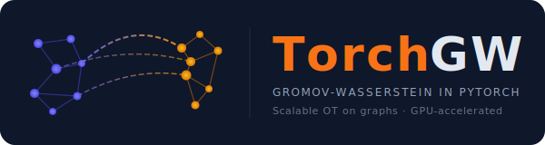

TorchGW — Fast Sampled Gromov-Wasserstein
=====================================

|

A scalable solver for `Gromov-Wasserstein <https://arxiv.org/abs/1805.09114>`_
optimal transport, implemented in **pure PyTorch** (no POT dependency at runtime).

Instead of computing the full :math:`N \times K` cost matrix each iteration,
TorchGW **samples** :math:`M` anchor pairs and runs Dijkstra from those sources only,
reducing the per-iteration cost from :math:`O(NK(N+K))` to :math:`O(NKM)`.

.. toctree::
   :maxdepth: 2
   :caption: Contents

   quickstart
   api
   algorithm
   benchmark
   changelog
   optimization-log

Installation
------------

.. code-block:: bash

   pip install -e .

Dependencies: ``numpy``, ``scipy``, ``scikit-learn``, ``torch``, ``joblib``.
No POT required at runtime.
