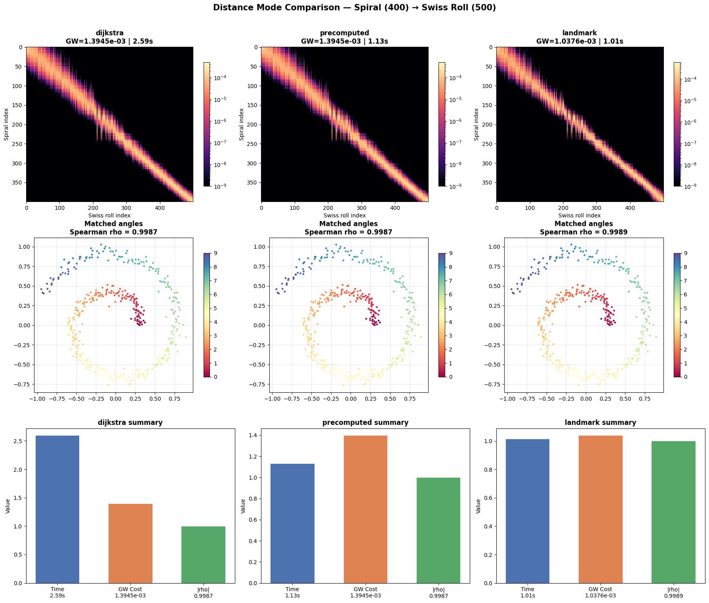

# Distance Mode Benchmark: Spiral to Swiss Roll

Comparison of the three distance computation strategies in TorchGW v0.2.0
on the canonical spiral (400 pts, 2D) to Swiss roll (500 pts, 3D) alignment task.

## Setup

- **Source**: 2D spiral, 400 points
- **Target**: 3D Swiss roll, 500 points
- **Parameters**: M=80, alpha=0.8, max_iter=200, epsilon=0.005, k=5
- **Hardware**: NVIDIA GPU (CUDA), Linux

## Results

| Mode | Time (s) | Iters | GW Cost | Spearman rho (angle) | Spearman rho (monotone) |
|------|:--------:|:-----:|:-------:|:--------------------:|:-----------------------:|
| dijkstra | 2.59 | 200 | 1.39e-3 | 0.9987 | 0.9987 |
| precomputed | 1.13 | 200 | 1.39e-3 | 0.9987 | 0.9987 |
| landmark (d=20) | 1.01 | 200 | 1.04e-3 | 0.9989 | 0.9989 |



## Analysis

### Dijkstra (default, medium scale)

On-the-fly Dijkstra from M sampled anchors each iteration. Exact geodesic distances,
but CPU-bound — Dijkstra accounts for ~52% of wall time.

### Precomputed (small scale)

Computes all-pairs shortest paths once before the loop, then indexes columns.
Same exact distances as dijkstra, so alignment quality is identical (rho = 0.9987).
~2.3x faster than dijkstra on this 400x500 problem because the upfront O(N^2 log N)
cost is amortized over 200 iterations.

Becomes impractical at N > ~5k due to O(N^2) memory.

### Landmark Dijkstra (large scale)

Selects 20 well-spread landmark nodes via farthest-point sampling, computes shortest
paths from each landmark to all nodes. This gives each node a 20-dimensional
"coordinate vector" (its distances to each landmark). At query time, Euclidean
distance in this coordinate space approximates geodesic distance.

Key observations:
- **Quality**: rho = 0.9989, matching or slightly exceeding the exact methods.
  This is because the landmark distances use real shortest paths (not an approximation
  like spectral embedding), so the coordinate space faithfully represents the graph
  metric.
- **Speed**: fastest of the three (1.01s), because precomputation is only 20 Dijkstra
  runs (vs 400+500 for full precomputed), and per-iteration distance is a GPU
  `torch.cdist` call.
- **Memory**: O(N * d) where d = n_landmarks, much smaller than O(N^2).
- **Scalability**: the only strategy viable at N > 50k. Increasing d improves accuracy
  at the cost of more precomputation.

## Recommendations

| Scale | Recommended Mode | Reason |
|-------|-----------------|--------|
| N < 5k | `precomputed` | Exact geodesic, fast via precomputation |
| 5k - 50k | `dijkstra` (default) | Exact geodesic, no precomputation needed |
| N > 50k | `landmark` | O(Nd) memory, GPU-accelerated per-iteration |

## Reproducing

```bash
PYTHONPATH=. python examples/benchmark_distance_modes.py
```
